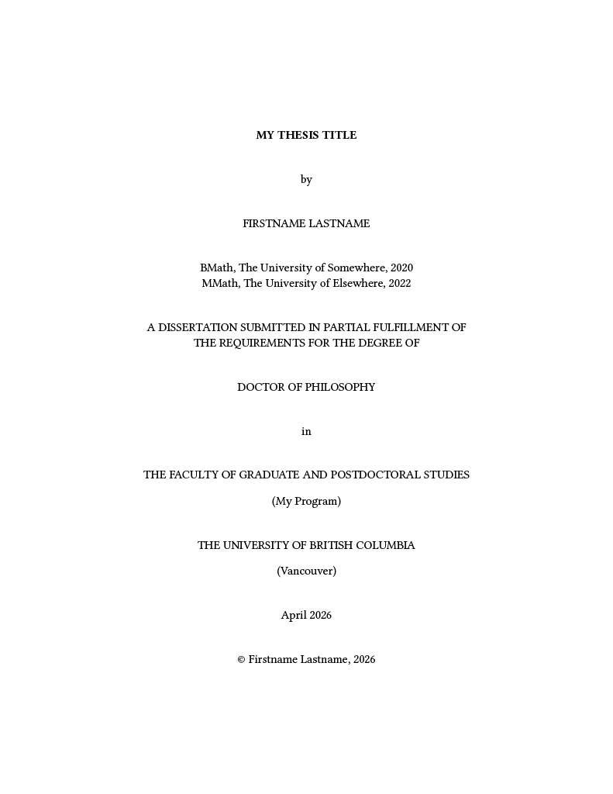
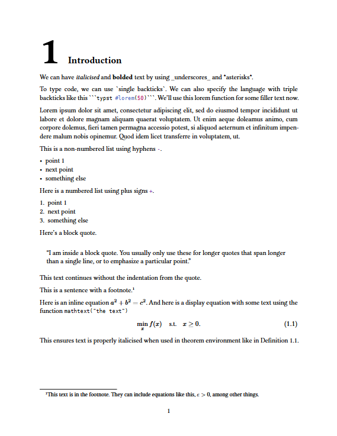
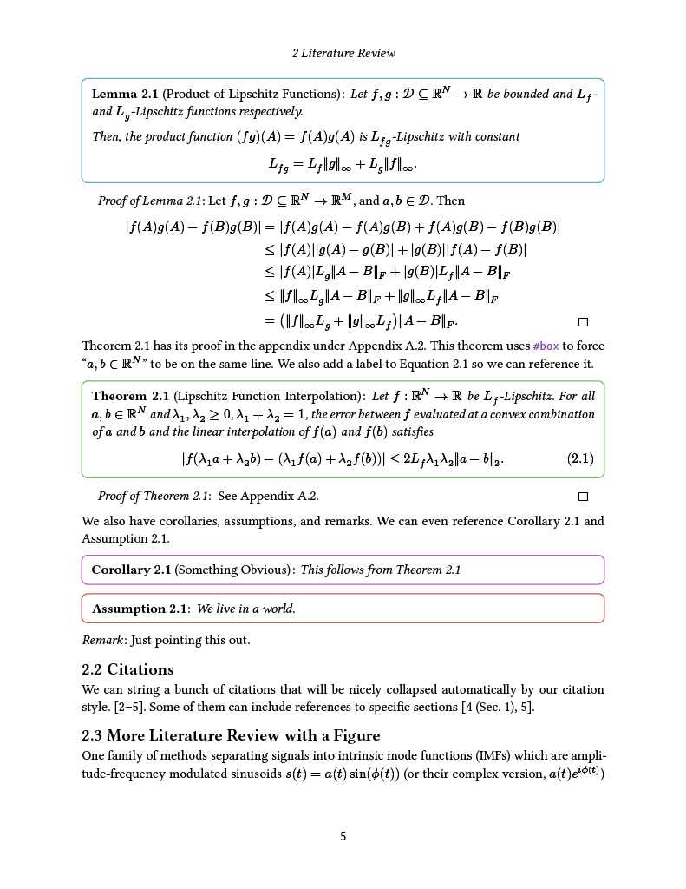
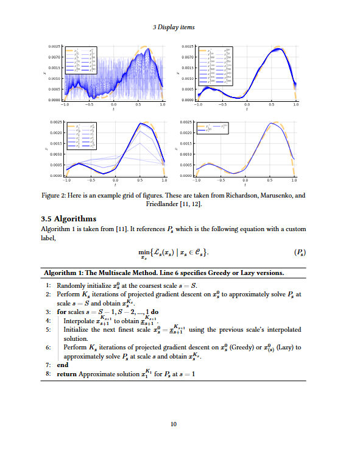
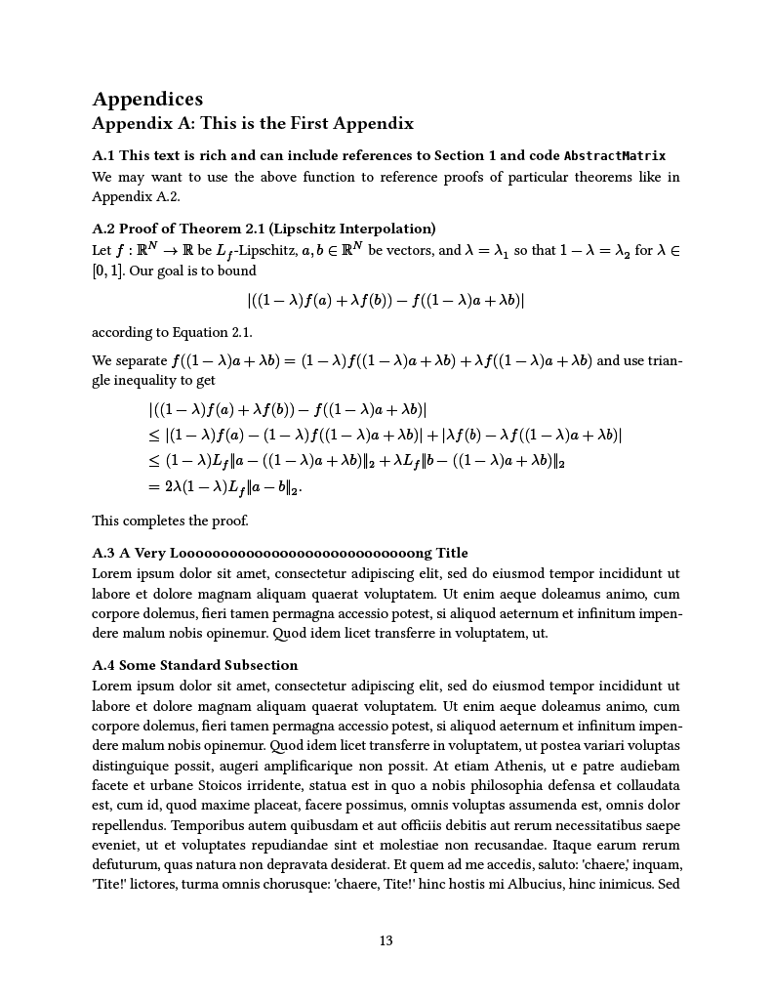

# UBC Thesis Typst Template

Version 1.0.0

A master's and PhD thesis template specialized for degrees at The University of British Columbia.

Typst is a powerful, friendly, and real-time rendering software for creating documents. This makes is a great tool for typesetting your thesis and a strong competitor over MS Word or LaTeX. Learn more about it here: https://typst.app/home/.

I created this template for my own PhD thesis which you can see here: https://github.com/njericha/phd-thesis.

## Sample pages







## TO USE...

Use the main file `ubc_thesis.typ` to type your thesis. You can optionally fine-tune the style by modifying `ubc_thesis_style.typ`.


### ...Online
This option is similar to those familiar with [Overleaf](https://www.overleaf.com/).

1. Download the repository at https://github.com/njericha/ubc-thesis-typst-template.
2. Make a (free) Typst account at https://typst.app/ and login to the app.
3. Create a new project and upload the files to this project
4. Happy writing!

### ...Offline

1. Clone the repository at https://github.com/njericha/ubc-thesis-typst-template.
2. Install typst. See https://typst.app/open-source/
3. Use your preferred editor and extensions. I used VS Code with the Tinymist Typst: https://marketplace.visualstudio.com/items?itemName=myriad-dreamin.tinymist
4. Happy writing!

## Contribute

Contributions are welcome. Feel free to make a pull-request or raise an issue at https://github.com/njericha/ubc-thesis-typst-template.

## Features

This template follows The University of British Columbia's thesis structure and style. Please check the most up-to-date requirements for your program at https://www.grad.ubc.ca/current-students/dissertation-thesis-preparation.

This template includes:
- **Front matter**: committee page, abstract, lay summary, preface, table of contents, list of tables, list of figures, list of symbols, list of abbreviations, acknowledgments, dedication
- Multiple section/figure/equation/theorem **referencing** with `#Cref`, `#eq_ref`, and `#thm_ref` thanks to the [smararef](https://typst.app/universe/package/smartaref) package
- **Abbreviations** using the [abbr](https://typst.app/universe/package/abbr) package
- **Theorems**, lemmas, definitions etc. using the [ctheorems](https://typst.app/universe/package/ctheorems/) package
- **Page headers** showing the current section/chapter using the [hydra](https://typst.app/universe/package/hydra) package
- Example **algorithm** using the [algorithmic](https://typst.app/universe/package/algorithmic) package
- Support for **alternate heading titles and captions** that appear differently in table of contents, list of figures, and PDF bookmarks than than the main body. This is useful for long titles and captions, or ones that include references to other items in your thesis
- Example **bibliography and citations** using a modified IEEE citation style. You can find the most appropriate style for your discipline at https://www.zotero.org/styles
- Custom **appendix formatting**
- Example **equations, lists and footnotes**
- Example **code blocks**
- Example **tables and figures** including a grid layout of figures

## Credit

This template was created by Nicholas Joseph Emile Richardson in 2026 for their PhD thesis at The University of British Columbia. Please share and modify the template in accordance to the Apache-2.0 License. If you found this template helpful, consider acknowledging this template using the following citation.

```bibtex
@misc{richardson_typst_template_2026,
   author = {Richardson, Nicholas J. E.},
   title = {{UBC Thesis Typst Template v1.0.0}},
   publisher = {GitHub},
   journal = {GitHub},
   howpublished = {\url{https://github.com/njericha/ubc-thesis-typst-template}},
   url = {https://github.com/njericha/ubc-thesis-typst-template},
   year = {2026},
}
```
